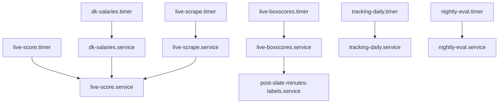
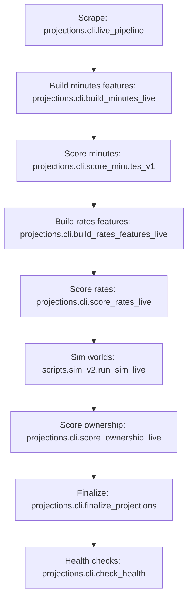

# NBA Projections/Sim Pipeline — Comprehensive Audit Report

Generated (UTC): 2025-12-19T01:51:26Z  
Repo: `/home/daniel/projects/projections-v2` @ `6d45660aeef52e3fd83d01319af225cc086e413e`  
Primary data root: `/home/daniel/projections-data`

This report is an **inventory-first** audit of the current NBA projections + sim pipeline as found on the host. It is intentionally **evidence-based** (systemd unit files, repo scripts, and observed failures). Recommendations and migration planning are in:

- `docs/audit/ROOT_CAUSES.md`
- `docs/audit/TARGET_ARCHITECTURE.md`
- `docs/audit/MIGRATION_PLAN.md`
- `docs/audit/BACKFILL_DESIGN.md`
- `docs/audit/RUNBOOK.md`

The machine-readable inventory backing this report is: `docs/audit/pipeline_inventory.json`.

## 1) Executive Summary (Current State)

- The pipeline is orchestrated primarily by **systemd timers** (system units under `/etc/systemd/system`) with an additional **duplicate set of user-level timers** (`~/.config/systemd/user`) for `live-score` and `live-scrape`.
- A **user crontab** runs additional DK contest scraping jobs from an **external repo** (`/home/daniel/sim-v2`) and writes logs to `/home/daniel/dkresults/logs`.
- The “main” daily/live pipeline entrypoint is `live-score.service` → `scripts/run_live_score.sh`, which in a single runner executes:
  - scrape (injuries/odds/roster/schedule) → minutes features → minutes scoring → rates features → rates scoring → sim → ownership → finalize → health checks
- Observability is split between **journald** and a mutable status snapshot store (`/home/daniel/projections-data/bronze/pipeline_status`). The configured systemd `OnFailure=` handler references a **missing unit**, making automated alerting ineffective.
- There are several **structural reliability hazards** causing recurring manual intervention: overlapping schedulers, time-gated behavior embedded in scripts, non-atomic “latest” pointers/outputs, inconsistent `run_id` usage in at least one legacy runner, and an API port conflict causing constant restarts.

## 2) Schedulers Currently In Use

### 2.1 systemd (system units under `/etc/systemd/system`)

**Enabled timers (active scheduling):**

| Timer | OnCalendar | Triggers | ExecStart | Notes |
|---|---|---|---|---|
| `live-score.timer` | `*-*-* 08..23:*:00/5` | `live-score.service` | `scripts/run_live_score.sh` | Main production live loop |
| `live-scrape.timer` | `*-*-* 08..23:05,35:00` | `live-scrape.service` | `scripts/run_live_scrape.sh` | Scrape-only loop |
| `freeze-slates.timer` | `*-*-* 08..23:*:00/5` | `freeze-slates.service` | `python -m projections.cli.freeze_slates freeze-pending` | Builds frozen slate snapshots |
| `dk-salaries.timer` | `Mon..Sun 14:05` | `dk-salaries.service` | `python -m scripts.dk.run_daily_salaries --site dk --slate-type main` | DK salaries for downstream ownership/finalize |
| `dk-ownership-aggregate.timer` | `*-*-* 02:00:00` | `dk-ownership-aggregate.service` | `python scrapers/dk_contests/build_ownership_data.py` | Depends on external contest data ingestion |
| `live-boxscores.timer` | `*-*-* 03:30:00` | `live-boxscores.service` | `scripts/run_boxscores.sh` | Prior-slate boxscores/labels refresh |
| `tracking-daily.timer` | `*-*-* 04:00:00` | `tracking-daily.service` | `scripts/run_tracking_daily.sh` | Daily tracking scrape + roles build |
| `post-slate-minutes-labels.timer` | `*-*-* 06:00:00` | `post-slate-minutes-labels.service` | `scripts/run_post_slate_minutes_labels.sh` | Backfills minutes labels for yesterday |
| `nightly-eval.timer` | `*-*-* 10:30` | `nightly-eval.service` | `python -m scripts.analyze_accuracy` | Writes eval report JSON |

**Installed but disabled timers (exist on disk, not currently scheduling):**

| Timer | OnCalendar | Triggers | Notes |
|---|---|---|---|
| `gold-features-daily.timer` | `*-*-* 10:00` | `gold-features-daily.service` | Disabled |
| `live-pipeline-hourly.timer` | `*-*-* 08..23:00` | `live-pipeline.service` | Disabled; legacy runner |
| `live-pipeline-evening.timer` | `Mon..Fri *-*-* 16..23:00/10` | `live-pipeline-evening.service` | Disabled; legacy runner |
| `live-pipeline-weekend.timer` | `Sat,Sun *-*-* 12..23:00/15` | `live-pipeline-weekend.service` | Disabled; legacy runner; unit override clears `--skip-odds` |
| `live-sim.timer` | `*-*-* 10..23:20,50:00` | `live-sim.service` | Disabled; legacy sim runner |

**Long-running services (not timers):**

| Service | Role | Notes |
|---|---|---|
| `minutes-dashboard.service` | Minutes API + static UI assets | Binds `0.0.0.0:8501` |
| `live-api.service` | Minutes API | Also binds `0.0.0.0:8501` (conflicts with `minutes-dashboard.service`) |
| `mlflow.service` | MLflow tracking server | Uses sqlite backend under `/home/daniel/projections-data/mlflow/mlflow.db` |

**Alerting/notifications:**
- `live-score.service`, `live-scrape.service`, and `live-sim.service` specify `OnFailure=status-email-user@%n.service`.
- `/etc/systemd/system/status-email-user@.service` is **missing**, and journald shows “Failed to enqueue OnFailure job” when failures occur.

### 2.2 systemd (user units under `~/.config/systemd/user`)

The following are **enabled duplicates** of the system timers/services:

| User timer | OnCalendar | Triggers | Key env diffs vs system unit |
|---|---|---|---|
| `live-score.timer` | `*-*-* 08..23:*:00/5` | `live-score.service` | User unit sets `LIVE_DISABLE_TIP_WINDOW=0` (system sets `1`) and does not set `LIVE_SIM_PROFILE`/`LIVE_SIM_WORLDS` |
| `live-scrape.timer` | `*-*-* 08..23:05,35:00` | `live-scrape.service` | Same schedule; env is similar |

This is a high-risk source of **duplicate triggers** and “which config actually ran?” ambiguity (even if scripts implement `flock` and exit early, it still creates log noise and non-determinism).

### 2.3 cron

**User crontab (`crontab -l`) — external dependency:**

```
0 15 * * * /usr/bin/flock -n /tmp/nba_gpp_scraper.lock /bin/bash -lc '/home/daniel/sim-v2/scrapers/run_nba_gpp_scraper.sh' >> /home/daniel/dkresults/logs/nba_gpp_scraper_$(date +\%F).log 2>&1
30 18 * * * /usr/bin/flock -n /tmp/nba_gpp_scraper.lock /bin/bash -lc '/home/daniel/sim-v2/scrapers/run_nba_gpp_scraper.sh' >> /home/daniel/dkresults/logs/nba_gpp_scraper_$(date +\%F).log 2>&1
0 21 * * * /usr/bin/flock -n /tmp/nba_gpp_scraper.lock /bin/bash -lc '/home/daniel/sim-v2/scrapers/run_nba_gpp_scraper.sh' >> /home/daniel/dkresults/logs/nba_gpp_scraper_$(date +\%F).log 2>&1
5 15 * * * /usr/bin/flock -n /tmp/nba_results_downloader.lock /bin/bash -lc '/home/daniel/sim-v2/scrapers/run_download_nba_results.sh' >> /home/daniel/dkresults/logs/nba_results_downloader_$(date +\%F).log 2>&1
35 18 * * * /usr/bin/flock -n /tmp/nba_results_downloader.lock /bin/bash -lc '/home/daniel/sim-v2/scrapers/run_download_nba_results.sh' >> /home/daniel/dkresults/logs/nba_results_downloader_$(date +\%F).log 2>&1
5 21 * * * /usr/bin/flock -n /tmp/nba_results_downloader.lock /bin/bash -lc '/home/daniel/sim-v2/scrapers/run_download_nba_results.sh' >> /home/daniel/dkresults/logs/nba_results_downloader_$(date +\%F).log 2>&1
```

**System cron:** no pipeline-related entries detected in `/etc/crontab`, `/etc/cron.d/*`, or `/etc/cron.{hourly,daily,weekly,monthly}`.

### 2.4 Other schedulers (tmux/watch loops/etc.)

- No active “watch loops” or tmux/screen runbooks were found in repo docs; legacy `nohup` traces exist under `obsolete/logs/` only.
- No Docker Compose or Makefile-based orchestration was found in the repo root.

## 3) Pipeline Entry Points (Code-Level)

### 3.1 Scheduled entrypoints (called by systemd)

| Unit | Entrypoint | Calls (high-level) |
|---|---|---|
| `live-scrape.service` | `scripts/run_live_scrape.sh` | `python -m projections.cli.live_pipeline` |
| `live-score.service` | `scripts/run_live_score.sh` | `projections.cli.live_pipeline`, `projections.cli.build_minutes_live`, `projections.cli.score_minutes_v1`, `projections.cli.build_rates_features_live`, `projections.cli.score_rates_live`, `scripts.sim_v2.run_sim_live`, `projections.cli.score_ownership_live`, `projections.cli.finalize_projections`, `projections.cli.check_health` |
| `freeze-slates.service` | `python -m projections.cli.freeze_slates freeze-pending` | Snapshot/publish slate “freeze” artifacts |
| `dk-salaries.service` | `python -m scripts.dk.run_daily_salaries` | DK draftables → gold salaries partitions |
| `dk-ownership-aggregate.service` | `python scrapers/dk_contests/build_ownership_data.py` | Aggregate contest results into training artifacts |
| `live-boxscores.service` | `scripts/run_boxscores.sh` | `python -m projections.etl.boxscores` |
| `tracking-daily.service` | `scripts/run_tracking_daily.sh` | `python -m scripts.tracking.scrape_tracking_raw`, `python -m scripts.tracking.build_tracking_roles` |
| `post-slate-minutes-labels.service` | `scripts/run_post_slate_minutes_labels.sh` | `python -m projections.cli.backfill_minutes_labels` |
| `nightly-eval.service` | `python -m scripts.analyze_accuracy` | Writes `eval_latest.json` |

### 3.2 Backfill entrypoints (existing)

Existing backfill/replay patterns are inventoried in `docs/audit/pipeline_inventory.json` under `backfill_entrypoints` and `backfill_capability_by_asset`.

Notable entrypoints:
- `scripts/backfill_season.sh` (date loop wrapper around `scripts/run_live_score.sh` with `LIVE_BACKFILL_MODE=1`)
- `scripts/backfill_injuries.py`
- `scripts/backfill_slates.py`
- `projections/cli/backfill_minutes_labels.py`
- `scripts/minutes/backfill_projections_minutes_v1.py`
- `scripts/tracking/scrape_tracking_raw.py backfill`
- `scripts/backfill_boxscores_from_json.py`

### 3.3 Training/evaluation/manual CLIs (non-scheduled)

Core examples (not exhaustive):
- Minutes training/eval: `projections/cli/train_minutes_dual.py`, `projections/cli/sequential_backtest.py`
- Rates training: `scripts/rates/train_rates_v1.py`, `scripts/rates/build_training_base.py`
- Usage shares training: `scripts/usage_shares_v1/train_lgbm.py`, `scripts/usage_shares_v1/decision_report.py`
- Ownership training: `scripts/ownership/train_ownership_v1.py`, `scripts/ownership/build_ownership_training_base.py`

## 4) Model Heads, “Current/Production” Selection, and Artifact Locations

The currently-selected production runs are configured via repo JSON pointers and hardcoded defaults.

### 4.1 Minutes (`minutes_v1`)

- Selector: `config/minutes_current_run.json`
- Current run: `minutes_v1_safe_starter_20251214`
- Artifact root: `/home/daniel/projects/projections-v2/artifacts/minutes_lgbm/minutes_v1_safe_starter_20251214`
- Heads:
  - `minutes_quantile_p10`, `minutes_quantile_p50`, `minutes_quantile_p90`, `play_prob`

### 4.2 Rates (`rates_v1`) — 12 LightGBM heads

- Selector: `config/rates_current_run.json`
- Artifact root: `/home/daniel/projections-data/artifacts/rates_v1/runs/rates_v1_stage1_20251215_145548`
- Heads:
  - `fga2_per_min`, `fga3_per_min`, `fta_per_min`, `ast_per_min`, `tov_per_min`, `oreb_per_min`, `dreb_per_min`, `stl_per_min`, `blk_per_min`, `fg2_pct`, `fg3_pct`, `ft_pct`

### 4.3 Ownership (`ownership_v1`)

- Selector: hardcoded in `projections/cli/score_ownership_live.py`
- Current run: `dk_only_v6_logit_chalk5_cleanbase_seed1337`
- Artifact root: `/home/daniel/projections-data/artifacts/ownership_v1/runs/dk_only_v6_logit_chalk5_cleanbase_seed1337`

### 4.4 Usage shares (`usage_shares_v1`)

- Selector: `config/usage_shares_current_run.json`
- Current run: `decision_20251216_083525`

### 4.5 FPTS model(s)

- `projections/models/fpts_lgbm.py` exists, but a “current run” pointer analogous to `config/*_current_run.json` appears to be missing for some paths (older CLI modules exist only as `__pycache__` artifacts, suggesting historical drift).

## 5) Data/Artifact Locations and Medallion Stages

The pipeline uses a medallion-style filesystem layout under `/home/daniel/projections-data`, plus repo-local artifacts for minutes.

High-level stages (see `docs/audit/pipeline_inventory.json` → `data_assets` for details):

- **Bronze**: raw scrapes and append-only histories (some have a mutable “latest view” alongside append-only partitions)
- **Silver**: merged/deduped snapshots (often mutable, monthly)
- **Gold**: “consumption” tables used by downstream scoring/sim/optimizer (often partitioned by `game_date` or `season`)
- **Live**: run-scoped features for live scoring (`/home/daniel/projections-data/live/...`)
- **Artifacts**: model runs, diagnostics, simulation worlds, unified projections, etc.

Key reliability note: several steps read/write mutable “latest” pointers/files (e.g., `latest_run.json`, `summary.json`, parquet overwrites) that are not consistently written atomically across the codebase.

## 6) Current Dependency Graph (Jobs/Assets)

### 6.1 Top-level job DAG (systemd view)



### 6.2 Internal “live-score” step graph (single runner)



### 6.3 Implicit dependencies (high-risk)

- “Latest” reads (selecting most-recent run directories by mtime, reading mutable snapshot parquet files, and reading `latest_run.json` pointers).
- Cross-root IO (minutes artifacts live under the repo root; most other assets live under `/home/daniel/projections-data`).
- Time-gated behavior embedded in runners (skip ownership if first game locked; roster age thresholds unless `--backfill-mode`).

## 7) Job-by-Job Inventory (Purpose, IO, Idempotency, Failure Modes)

This is summarized in `docs/audit/pipeline_inventory.json` under `jobs`.

Observed highlights:
- `systemd.live-score` is the primary “everything” runner; failures include network/DNS/SSL issues and data freshness assertions (roster staleness).
- `systemd.tracking-daily` has an observed schema/typing failure (`numpy.float64` has no `.fillna`) indicating missing expectation checks.
- `systemd.live-pipeline` exists and is enabled as a oneshot service, but is structurally broken (run_id mismatch) and should be treated as legacy until fixed or removed from scheduling.

## 8) Backfill Inventory (Existing + Gaps)

Backfills exist, but are not first-class end-to-end workflows with standardized partitions/manifests.

Key gap: some production steps are **time-gated** (ownership and finalize behavior changes after lock) and many readers depend on mutable “latest” inputs, which breaks deterministic historical replays.

See:
- `docs/audit/pipeline_inventory.json` → `backfill_entrypoints`
- `docs/audit/pipeline_inventory.json` → `backfill_capability_by_asset`

## 9) Logs, Status, and Observability (Current)

**Logs:**
- Most scheduled jobs log to **journald** (`journalctl -u <unit>`).
- User cron jobs log to `/home/daniel/dkresults/logs/*.log`.

**Status tracking:**
- `/home/daniel/projections-data/bronze/pipeline_status` contains JSON snapshots keyed by `(job_name, target_date)` but is mutable and not append-only.

**Alerting:**
- systemd `OnFailure` is configured for several critical units but is currently ineffective due to the missing `status-email-user@.service`.

## Appendix A) Full Scheduler Inventory

This appendix lists every relevant scheduler line/unit currently in use (systemd system units, systemd user units, and cron entries). For the canonical machine-readable version (including more fields), see `docs/audit/pipeline_inventory.json` → `schedulers`.

### A.1 systemd system units (installed)

Timers:
- `live-score.timer` — `OnCalendar=*-*-* 08..23:*:00/5`
- `live-scrape.timer` — `OnCalendar=*-*-* 08..23:05,35:00`
- `freeze-slates.timer` — `OnCalendar=*-*-* 08..23:*:00/5`
- `dk-salaries.timer` — `OnCalendar=Mon..Sun 14:05`
- `dk-ownership-aggregate.timer` — `OnCalendar=*-*-* 02:00:00`
- `live-boxscores.timer` — `OnCalendar=*-*-* 03:30:00`
- `tracking-daily.timer` — `OnCalendar=*-*-* 04:00:00`
- `post-slate-minutes-labels.timer` — `OnCalendar=*-*-* 06:00:00`
- `nightly-eval.timer` — `OnCalendar=*-*-* 10:30`
- `gold-features-daily.timer` — `OnCalendar=*-*-* 10:00` (disabled)
- `live-pipeline-hourly.timer` — `OnCalendar=*-*-* 08..23:00` (disabled)
- `live-pipeline-evening.timer` — `OnCalendar=Mon..Fri *-*-* 16..23:00/10` (disabled)
- `live-pipeline-weekend.timer` — `OnCalendar=Sat,Sun *-*-* 12..23:00/15` (disabled)
- `live-sim.timer` — `OnCalendar=*-*-* 10..23:20,50:00` (disabled)

Services (ETL jobs):
- `live-score.service` → `ExecStart=/home/daniel/projects/projections-v2/scripts/run_live_score.sh` (OnFailure handler missing)
- `live-scrape.service` → `ExecStart=/home/daniel/projects/projections-v2/scripts/run_live_scrape.sh` (OnFailure handler missing)
- `freeze-slates.service` → `ExecStart=/home/daniel/.local/bin/uv run python -m projections.cli.freeze_slates freeze-pending`
- `dk-salaries.service` → `ExecStart=... uv run python -m scripts.dk.run_daily_salaries ...`
- `dk-ownership-aggregate.service` → `ExecStart=... uv run python scrapers/dk_contests/build_ownership_data.py`
- `live-boxscores.service` → `ExecStart=/home/daniel/projects/projections-v2/scripts/run_boxscores.sh`
- `tracking-daily.service` → `ExecStart=/home/daniel/projects/projections-v2/scripts/run_tracking_daily.sh`
- `post-slate-minutes-labels.service` → `ExecStart=/home/daniel/projects/projections-v2/scripts/run_post_slate_minutes_labels.sh`
- `nightly-eval.service` → `ExecStart=/home/daniel/.local/bin/uv run python -m scripts.analyze_accuracy ...`
- `gold-features-daily.service` → `ExecStart=/home/daniel/projects/projections-v2/scripts/run_gold_daily.sh` (disabled)
- `live-pipeline.service` → `ExecStart=/home/daniel/projects/projections-v2/scripts/run_live_pipeline.sh` (enabled oneshot; legacy/broken)
- `live-pipeline-evening.service` → `ExecStart=/home/daniel/projects/projections-v2/scripts/run_live_pipeline.sh` (disabled; legacy/broken)
- `live-pipeline-weekend.service` → `ExecStart=/home/daniel/projects/projections-v2/scripts/run_live_pipeline.sh` (disabled; legacy/broken)
- `live-sim.service` → `ExecStart=/home/daniel/projects/projections-v2/scripts/run_live_sim.sh` (disabled; OnFailure handler missing)

Services (APIs):
- `minutes-dashboard.service` → `ExecStart=... uvicorn ... --port 8501`
- `live-api.service` → `ExecStart=... uvicorn ... --port 8501` (port conflict)
- `mlflow.service` → `ExecStart=... mlflow server --port 5000`

### A.2 systemd user units (enabled duplicates)

- `~/.config/systemd/user/live-score.timer` — `OnCalendar=*-*-* 08..23:*:00/5`
- `~/.config/systemd/user/live-score.service` — `ExecStart=/home/daniel/projects/projections-v2/scripts/run_live_score.sh`
- `~/.config/systemd/user/live-scrape.timer` — `OnCalendar=*-*-* 08..23:05,35:00`
- `~/.config/systemd/user/live-scrape.service` — `ExecStart=/home/daniel/projects/projections-v2/scripts/run_live_scrape.sh`

### A.3 cron (user)

See Section 2.3 for the complete crontab lines.

## Appendix B) Pipeline Entrypoints (Inventory)

The repo contains many runnable scripts (including ad-hoc analysis/debug tools). This appendix lists the **pipeline entrypoints** detected for this audit (the canonical machine-readable copy is `docs/audit/pipeline_inventory.json` → `entrypoints_detected`).

### B.1 Bash entrypoints

- `scripts/run_boxscores.sh`
- `scripts/run_gold_daily.sh`
- `scripts/run_live_pipeline.sh`
- `scripts/run_live_rates.sh`
- `scripts/run_live_score.sh`
- `scripts/run_live_scrape.sh`
- `scripts/run_live_sim.sh`
- `scripts/run_minutes_stack.sh`
- `scripts/run_post_slate_minutes_labels.sh`
- `scripts/run_tracking_daily.sh`
- `scripts/backfill_season.sh`
- `run_stack.sh`

### B.2 Python entrypoints (CLI modules/scripts)

- `projections/cli/backfill_minutes_labels.py`
- `projections/cli/build_archetype_deltas.py`
- `projections/cli/build_minutes_labels.py`
- `projections/cli/build_minutes_live.py`
- `projections/cli/build_minutes_roles.py`
- `projections/cli/build_minutes_snapshot_dataset.py`
- `projections/cli/build_month.py`
- `projections/cli/build_rates_features_live.py`
- `projections/cli/build_starter_priors.py`
- `projections/cli/build_training_dataset.py`
- `projections/cli/check_health.py`
- `projections/cli/check_minutes_live.py`
- `projections/cli/eval_minutes_asymmetric.py`
- `projections/cli/eval_minutes_live.py`
- `projections/cli/finalize_projections.py`
- `projections/cli/freeze_slates.py`
- `projections/cli/live_pipeline.py`
- `projections/cli/score_minutes_v1.py`
- `projections/cli/score_ownership_live.py`
- `projections/cli/score_rates_live.py`
- `projections/cli/sequential_backtest.py`
- `projections/cli/train_minutes_dual.py`
- `projections/etl/boxscores.py`
- `projections/etl/daily_lineups.py`
- `projections/etl/injuries.py`
- `projections/etl/odds.py`
- `projections/etl/roster_nightly.py`
- `projections/etl/schedule.py`
- `projections/pipelines/build_features_minutes_v1.py`
- `scripts/analyze_accuracy.py`
- `scripts/backfill_boxscores_from_json.py`
- `scripts/backfill_injuries.py`
- `scripts/backfill_slates.py`
- `scripts/cleanup_bronze_partitions.py`
- `scripts/minutes/backfill_projections_minutes_v1.py`
- `scripts/sim_v2/run_sim_live.py`
- `scripts/tracking/build_tracking_roles.py`
- `scripts/tracking/scrape_tracking_raw.py`
