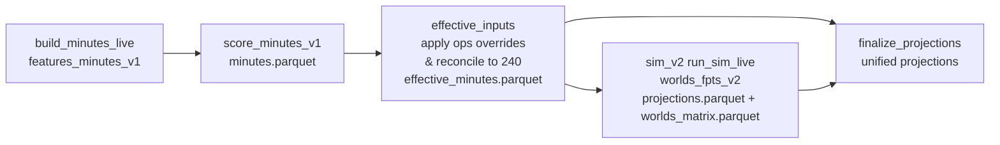

# Minutes Override Audit (Manual Minutes Delta / IN-OUT)

This note maps the **current** “manual minutes delta override” system end-to-end (live DFS pipeline), documents why “wrong players get vacated minutes” can happen, and proposes concrete hook points and a staged improvement plan.

Scope: this is an audit + diagnostics + plan (no allocator refactor yet).

## Update (Stage 1A hard targets/locks)

As of Stage 1A, Ops/GameView overrides support **hard minutes targets + locks**:

- `minutes_target` (absolute minutes) and `minutes_lock` (hold constant) are enforced in the **effective minutes** layer and the **sim team=240 allocator**.
- `minutes_delta` remains supported for backward compatibility, but is treated as **UI sugar** (delta → target+lock).

---

## Terminology (two different override systems)

There are **two** override systems in this repo that both talk about “minutes overrides”, but they operate at different layers:

1) **Ops / GameView overrides (authoritative for live minutes + sim)**  
   - Persisted under `artifacts/ops/overrides_v1/...` (JSON), applied to minutes/rates, and explicitly reconciled back to team=240.  
   - Entry points: `POST /api/ops/overrides` and the Minutes Dashboard “Manual Overrides” panel.  
   - Code: `projections/api/ops_api.py` (API), `projections/ops/overrides.py` (persistence + application).  
   - UI payload: `web/minutes-dashboard/src/components/PlayerOpsPanel.tsx:58`+.

2) **Optimizer “My Proj” (legacy user overrides, slate/draft-group scoped)**  
   - Persisted under `data_root/user_overrides/...` and applied inside optimizer pool building.  
   - Code: `projections/api/user_overrides.py:114`+, used by `projections/api/optimizer_service.py:741`+.  
   - This is **not** the minutes-delta system that feeds sim minutes; it’s for optimizer pool overrides.

This audit focuses on **(1)**.

---

## 1) Override entrypoints (load/parse/apply)

### UI → API payload (minutes_delta and “OUT”)

The Minutes Dashboard “Manual Overrides” panel builds `updates[]` and posts to `/api/ops/overrides`:

- `minutes_delta` is posted per player: `web/minutes-dashboard/src/components/PlayerOpsPanel.tsx:63-81`
- “OUT” is implemented by posting `ops_depth_role: "out"`: `web/minutes-dashboard/src/components/PlayerOpsPanel.tsx:67-75`

The UI also displays team totals as `current_minutes + pending_delta` (without showing downstream reconciliation effects): `web/minutes-dashboard/src/components/PlayerOpsPanel.tsx:168-180`.

### FastAPI endpoint (Ops overrides)

The Ops API accepts a per-player update schema that includes:
- `status` (for in/out), `play_prob`, minutes quantiles, and `minutes_delta`: `projections/api/ops_api.py:90-110`.

Persistence calls:
- `POST /api/ops/overrides` → `upsert_overrides(...)`: `projections/api/ops_api.py:137-143`.
- `GET /api/ops/overrides` → `list_overrides(...)`: `projections/api/ops_api.py:131-135`.
- `DELETE /api/ops/overrides` → `clear_overrides(...)`: `projections/api/ops_api.py:145-153`.

### Override persistence format + location

Overrides are written to:
- `data_root / "artifacts/ops/overrides_v1/game_date=YYYY-MM-DD/overrides.json"`: `projections/ops/overrides.py:90-97`.

The stored JSON payload shape is:
- `{version, game_date, updated_at, overrides:[{game_id, player_id, fields:{...}, updated_at, note, sticky_fields}]}`: `projections/ops/overrides.py:228-280`.

### Where “minutes deltas” are applied

The authoritative application point is:
- `apply_overrides_to_minutes_df(...)`: `projections/ops/overrides.py:697-941`.

`minutes_delta` semantics:
- If present, it is added to multiple quantile columns (`minutes_p10/p50/p90` and conditional aliases) and clipped to `[0, 48]`: `projections/ops/overrides.py:858-876`.
- Delta’d players are treated as **locked** for reconciliation purposes: `projections/ops/overrides.py:877-881`.

### Where “player in/out” is applied

There are two relevant ways to force “OUT”:

1) `ops_depth_role="out"` is normalized into `status="out"`: `projections/ops/overrides.py:887-895`.
2) `status="out"` forces `play_prob=0` and sets minutes columns (and `effective_minutes` if present) to `0`: `projections/ops/overrides.py:896-909`.

---

## 2) End-to-end live pipeline dataflow (actual wiring)

The canonical live orchestrator is the Prefect flow `prefect_flows/live_nba_pipeline.py`.

### High-level diagram

### Stage-by-stage details (paths, columns, invariants)

#### Stage 3: Minutes scoring (baseline)

Invoked from Prefect:
- Module run: `projections.cli.score_minutes_v1`: `prefect_flows/live_nba_pipeline.py:484-489`.
- Output location: `data_root/artifacts/minutes_v1/daily/<date>/run=<run_id>/minutes.parquet`: `prefect_flows/live_nba_pipeline.py:490-509`.

Key columns produced (representative; depends on model/config):
- Identity: `game_date, game_id, team_id, player_id, player_name, team_tricode, ...`
- State: `status, play_prob, is_projected_starter, is_confirmed_starter`
- Minutes quantiles: `minutes_p10, minutes_p50, minutes_p90, minutes_p10_cond, minutes_p50_cond, minutes_p90_cond` (see minutes output selection in `projections/cli/score_minutes_v1.py:1696`+)

Team-240 invariants at this stage depend on `minutes_alloc_mode` and `reconcile_team_minutes`:
- RotAlloc modes explicitly override conditional p50 with an allocator output (team-sum-to-240) and force reconcile off: `projections/cli/score_minutes_v1.py:2015-2021` and `projections/cli/score_minutes_v1.py:2564-2616`.

#### Stage 3.5: Effective minutes layer (authoritative overrides)

Prefect writes effective minutes immediately after scoring:
- `effective_minutes_task(...)` calls `effective_inputs.write_effective_minutes_layer(...)`: `prefect_flows/live_nba_pipeline.py:512-531`.

Effective inputs:
- Calls `apply_overrides_to_minutes_df(...)` with `log_diagnostics=True` and `force_reconcile=True`: `projections/pipeline/effective_inputs.py:42-60`.

Output file:
- `effective_minutes.parquet` written into the same minutes run directory: `projections/pipeline/effective_inputs.py:130-154`.

Invariants (enforced here):
- If overrides change team totals, `apply_overrides_to_minutes_df` reconciles back to target=240 per (game_id, team_id): `projections/ops/overrides.py:706-710` and `projections/ops/overrides.py:914-929`.

Key columns *added/materialized* for downstream:
- `minutes_delta`, `minutes_delta_applied`, `ops_override_applied`, `minutes_final`, `{minutes_*}_model`, and contract tags: `projections/ops/overrides.py:717-748` and `projections/ops/overrides.py:930-939`.

#### Stage 6: Sim worlds generation (minutes allocation + randomness)

Prefect calls:
- `scripts.sim_v2.run_sim_live` which calls `scripts.sim_v2.generate_worlds_fpts_v2:main`: `prefect_flows/live_nba_pipeline.py:877-907` and `scripts/sim_v2/run_sim_live.py:68-93`.

Minutes input selection (important):
- Sim prefers `effective_minutes.parquet` if present (daily first, then gold), falling back to `minutes.parquet`: `scripts/sim_v2/generate_worlds_fpts_v2.py:1059-1197`.

Where randomness enters:
- Per chunk, RNG is seeded as `np.random.default_rng(date_seed + chunk_start)`: `scripts/sim_v2/generate_worlds_fpts_v2.py:2547-2549`.
- Availability sampling: `active_mask` is drawn from `play_prob_eff`: `scripts/sim_v2/generate_worlds_fpts_v2.py:2551-2561`.
- Minutes sampling (one of several backends), then masked by `active_mask`: `scripts/sim_v2/generate_worlds_fpts_v2.py:2779-2796`.

Team-240 enforcement in sim worlds:
- After masking (and optional bench-zero mixture), minutes are projected to 240 per (team, world) via `allocate_team_minutes_matrix(...)`: `scripts/sim_v2/generate_worlds_fpts_v2.py:2852-2876`.
- This allocator is a weighted, bounded QP (“waterfilling with bounds”) that protects high-priority players: `projections/sim_v2/minutes_allocator.py:1-17` and weights `w = exp(k * normalized_priority)`: `projections/sim_v2/minutes_allocator.py:37-109`.

Optional additional redistribution:
- `bench_zero_mixture` can drop low-minute players to 0 and then redistribute minutes to the remaining active set: `scripts/sim_v2/generate_worlds_fpts_v2.py:2810-2833`.
- Some profiles can run a **pre-sim** QP reconcile on the input minutes frame (changing the point-estimate minutes before sampling): `scripts/sim_v2/generate_worlds_fpts_v2.py:2417-2449`.

#### Stage 8: Finalize unified projections

Final unified projections prefer the effective minutes file:
- It tries `effective_minutes.parquet` first, then falls back to `minutes.parquet`: `projections/cli/finalize_projections.py:244-259`.
- The unified minutes columns explicitly include `minutes_delta`, `minutes_delta_applied`, and `ops_override_applied`: `projections/cli/finalize_projections.py:40-82`.

---

## 3) Why “minutes deltas” can reallocate to the wrong players (concrete mechanisms)

### Mechanism A — Team reconciliation after overrides redistributes residuals using heuristics (not user intent)

After applying direct overrides + `minutes_delta`, `apply_overrides_to_minutes_df` optionally reconciles each team back to 240:
- `projections/ops/overrides.py:914-929`.

For legacy minutes frames (no explicit state column), reconciliation infers tiers from `(status, play_prob, minutes)`:
- OUT is only `status=="out"` or `play_prob<=0`: `projections/minutes/reconcile.py:85-90`.
- “rotation” is `minutes >= IN_ROTATION_THRESHOLD_MIN`: `projections/minutes/reconcile.py:91-98`.
- Anything else becomes `"unknown"` and is treated as **rotation-tier**: `projections/minutes/reconcile.py:94-110`.

Residual distribution rules:
- When adding minutes, tier=rotation first, then cameo: `projections/minutes/reconcile.py:318-327`.
- When removing minutes, cameo first, then rotation: `projections/minutes/reconcile.py:328-337`.

Why this can look like “wrong players got the vacated minutes”:
- The user specifies **only** a delta on one player; the code must offset that delta to preserve team totals. The offset is *not explicit* and is chosen by tier + weights, so the absorber might be a different player than the operator expects.

Minimal repro idea:
1. Build a synthetic team with some players at low minutes (< rotation threshold) and some at high minutes.
2. Apply `minutes_delta=+5` to a starter.
3. Reconcile will remove those 5 minutes from cameo players first (even if the user expected it to come from a specific rotation player). See tier ordering: `projections/minutes/reconcile.py:328-337`.

### Mechanism B — “Locked” is best-effort; if locked minutes exceed 240, the reconcile step **unlocks reductions**

Delta’d (and OUT) players are treated as locked: `projections/ops/overrides.py:877-909`.

But the reconcile routine explicitly relaxes the lock if locks alone exceed the team target:
- `locked_infeasible = locked_sum > target`: `projections/minutes/reconcile.py:288-291`
- If `locked_infeasible`, the adjustment mask includes locked rows: `projections/minutes/reconcile.py:299-303`

So a user can set multiple deltas such that locked_sum > 240, and then **even locked players will be reduced**, which feels like “my delta didn’t stick”.

Minimal repro idea:
1. Apply `minutes_delta=+10` to 6 players who are already near 40 minutes (many will clip to 48): `projections/ops/overrides.py:868-876`.
2. Now locked_sum can exceed 240; reconcile reduces locked players anyway: `projections/minutes/reconcile.py:299-303`.

### Mechanism C — Sim minutes allocation redistributes minutes per-world after availability/masking (and can ignore point-estimate absorbers)

Even if the **effective point estimate** is exactly what you want, sim worlds enforce team=240 after masking and optional bench-zero:
- Availability sampling: `scripts/sim_v2/generate_worlds_fpts_v2.py:2551-2561`
- Bench-zero mixture: `scripts/sim_v2/generate_worlds_fpts_v2.py:2810-2833`
- World-level team-240 projection: `scripts/sim_v2/generate_worlds_fpts_v2.py:2852-2876`

The allocator is a weighted QP that protects “priority” players:
- QP definition: `projections/sim_v2/minutes_allocator.py:7-16`
- Priority → weights `w=exp(k*z)` (higher weight = more protected): `projections/sim_v2/minutes_allocator.py:37-109`

Why this looks like “wrong players got vacated minutes”:
- In worlds where the delta’d player is inactive (`active_mask=False`), their minutes go to **whoever is active** and best satisfies the QP objective—often higher-priority starters—regardless of the point-estimate reconcile absorber.
- Bench-zero can drop fringe players and reallocate their minutes to others (sometimes amplifying or reversing the point-estimate absorber pattern).

Minimal repro idea:
1. Set `play_prob` of a key player to ~0.5 and apply a delta.
2. In half of worlds they’re inactive; their minutes are redistributed by the QP to active players (priority-weighted), not by the same deterministic reconcile used in the effective layer.

### Mechanism D — Optional pre-sim reconcile can rewrite input minutes before worlds sampling

Some profiles can run a pre-sim QP reconcile which replaces the input minutes center with a new 240-feasible vector:
- `scripts/sim_v2/generate_worlds_fpts_v2.py:2417-2449`.

If enabled, this is an additional redistribution step that can surprise operators who expect the effective minutes to be used “as-is”.

---

## 4) Control points for improved, predictable overrides

### Control points in current code

These are the highest leverage places to hook predictability improvements:

1) **Effective layer application + team reconcile**  
   - `projections/ops/overrides.py:697`+ (where minutes_delta/status are applied and where team reconciliation is invoked).
   - `projections/minutes/reconcile.py:175`+ (where residual minutes are distributed and “unknown” defaults to rotation).

2) **Sim per-world allocation**  
   - `scripts/sim_v2/generate_worlds_fpts_v2.py:2852`+ (where minutes are projected to 240 after masking).
   - `projections/sim_v2/minutes_allocator.py:143`+ (priority-weighted QP objective).

3) **UI feedback loop**  
   - `web/minutes-dashboard/src/components/PlayerOpsPanel.tsx:168-180` currently shows `base + delta`, but not “who will lose/gain minutes after reconciliation”.

---

## 5) Two alternative override designs (proposal only)

### A) “Hard constraint” style (locks/min/max inside allocator)

Goal: ensure overrides are enforced *inside* the place where minutes must sum to 240 (effective reconcile + sim allocator).

Where to implement:
- Effective layer team reconcile: `projections/ops/overrides.py` → pass explicit caps/locks into `reconcile_team_minutes(...)` (currently cap_col=None, state_col=None): `projections/ops/overrides.py:544-556`.
- Sim allocator: `projections/sim_v2/minutes_allocator.allocate_team_minutes_matrix(...)` already supports per-player caps via `cap` and “max_increase above baseline”: `projections/sim_v2/minutes_allocator.py:147-207`. Extend to accept “hard locks” for select players (e.g., fix m_i).

Proposed override schema additions (fields only):
- `minutes_lock: bool` (fix player minutes to current effective center)
- `minutes_min: float | None`
- `minutes_max: float | None`
- (optional) `minutes_target: float | None` (absolute minutes, preferred over delta)

Diagnostics/tests to add:
- A per-team “constraint report”: locked minutes sum, remaining minutes, cap feasibility.
- Unit tests ensuring locked players remain fixed unless infeasible (and the infeasibility is explicitly reported).

### B) “Routing” style (explicitly distribute vacated minutes via rule/weights)

Goal: make redistribution **operator-controlled** rather than heuristic-driven.

Where to implement:
- In `apply_overrides_to_minutes_df` **after** applying deltas/outs but **before** team reconciliation:
  - compute team residual and distribute it using explicit routing weights rather than tier heuristics.
  - code location: `projections/ops/overrides.py:858`+ (delta application) then a new routing step before `projections/ops/overrides.py:914`.

Proposed schema additions (fields only):
- Player-level: `absorb_weight: float | None` (higher = more likely to gain minutes)
- Team-level override record (new):  
  - `route_mode: "proportional" | "starter_only" | "rotation_only" | "custom"`  
  - `route_targets: {player_id: weight}` (explicit recipients)

Diagnostics/tests to add:
- Per-team “delta absorption table”: for every override event, record `donor -> recipients` attribution.
- Unit tests verifying routing is stable/deterministic and ignores players marked OUT/DNP.

---

## 6) Minimal staged improvement plan (concrete)

### Stage 0 — Observability (minimal code, immediate value)

Deliver:
- A per-team diagnostic report that decomposes minutes changes into:
  - `baseline` (from `minutes.parquet`)
  - `direct_override + delta` (pre-reconcile)
  - `reconcile_adjustment` (post-reconcile)

Implementation hook:
- A lightweight script that computes `(baseline → pre_reconcile → post_reconcile)` using `apply_overrides_to_minutes_df` with reconcile on/off.

### Stage 1 — Eliminate the biggest surprise with one minimal feature

Pick one:
- **Minutes locks (hard constraint)**: add `minutes_lock` and enforce it in effective-layer reconciliation (and surface infeasibility explicitly).  
  OR
- **Routing weights**: add `absorb_weight` and route residual minutes by weights instead of tier heuristics.

### Stage 2 — UI plumbing (high level)

Add UI affordances:
- Display a “Who absorbs this delta?” preview after saving (based on the effective-layer reconcile result).
- Allow either:
  - “lock minutes” toggles, or
  - routing weights / target selection for redistributed minutes.

---

## Appendix: Quick pointers

- Ops overrides apply point-estimate minutes deltas and OUT status: `projections/ops/overrides.py:858-909`.
- Team reconcile algorithm + tier rules: `projections/minutes/reconcile.py:53-110` and `projections/minutes/reconcile.py:318-337`.
- Sim world team-240 allocator: `projections/sim_v2/minutes_allocator.py:1-17` and `scripts/sim_v2/generate_worlds_fpts_v2.py:2852-2876`.
