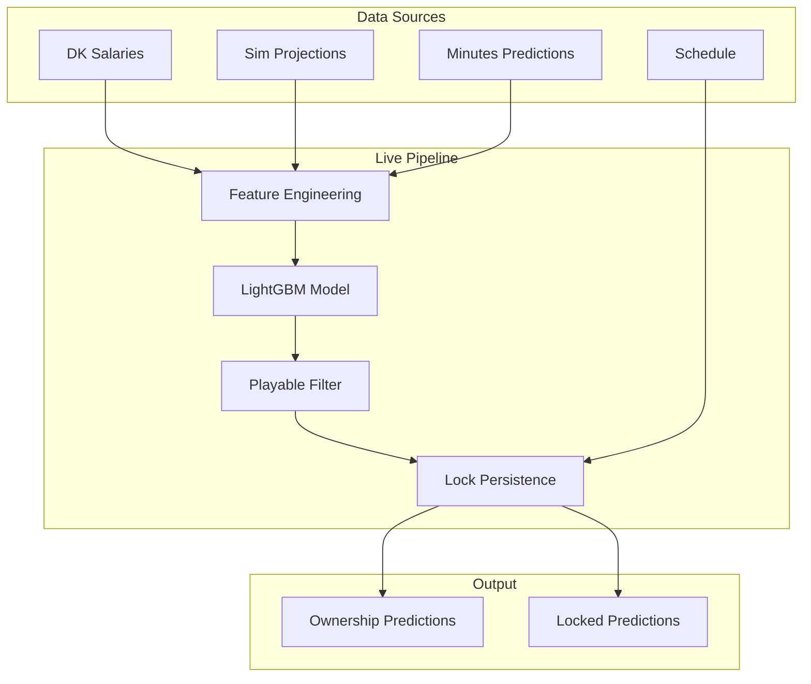

# Ownership Prediction System

This document describes the ownership prediction pipeline for DraftKings NBA slates.

For training + evaluation details (fixed slice, feature sets, model artifacts), see `docs/ownership_model.md`.

## Overview

The ownership system predicts what percentage of lineups will contain each player. Accurate ownership predictions are critical for:
- **Tournament strategy**: Identifying chalk vs. contrarian plays
- **Lineup optimization**: Balancing ceiling with field exposure
- **Value estimation**: Players with low ownership + high ceiling offer leverage

## Architecture



## Components

### 1. Model (`ownership_v1`)

**Location**: `projections/ownership_v1/`

The core ownership model is a LightGBM regressor trained on historical ownership data.

#### Features
Key features used by the model:
- `value_per_k`: FPTS projection / (salary / 1000)
- `salary_rank`: Player's salary rank within slate
- `proj_fpts_rank`: FPTS rank within slate
- `proj_fpts_zscore`: Z-score of FPTS within slate
- `salary`: Raw salary
- `is_value_tier`, `is_mid_tier`, `is_high_tier`: Salary tier flags
- Position dummies: `pos_PG`, `pos_SG`, etc.

#### Training Data
- **Labels**: DK contest actual ownership, aggregated per slate (`bronze/dk_contests/ownership_by_slate/all_ownership.parquet`)
- **Training base**: `gold/ownership_dk_base/ownership_dk_base.parquet` (built from DK labels + pre-lock features; may use LineStar only during dataset assembly)

#### Production Model
- **Run ID**: `dk_only_v6_logit_chalk5_cleanbase_seed1337`
- **Path**: `artifacts/ownership_v1/runs/{run_id}/`

### 2. Live Scoring (`score_ownership_live.py`)

**Location**: `projections/cli/score_ownership_live.py`

Runs as part of the live pipeline to generate ownership predictions for upcoming slates.

```bash
uv run python projections/cli/score_ownership_live.py \
    --date 2025-12-08 \
    --run-id live_v1 \
    --model-run dk_only_v6_logit_chalk5_cleanbase_seed1337
```

#### Data Flow
1. Load DK salaries (largest draft group = main slate)
2. Load FPTS projections from `sim_v2`
3. Match players via normalized names (handles European characters)
4. Filter OUT players (from injury status)
5. Compute ownership features
6. Run model prediction
7. Apply playable filter
8. Normalize to target slate sum (default `800%` for DK classic)
9. Apply lock persistence
10. Save per-slate parquet files to `silver/ownership_predictions/{date}/`

Notes:
- DK lock timing is derived from `bronze/dk/draftables/draftables_raw_<draft_group_id>.json` (`competitions[*].startTime`) so historical backtests don’t depend on partial schedule parquet coverage.
- For historical rescoring/backtests: `uv run python -m projections.cli.score_ownership_live --date YYYY-MM-DD --run-id backtest --data-root ~/projections-data --ignore-lock-cache --no-write-lock-cache`

### 3. Playable Filter

Zeros out ownership for players who are truly unplayable (model assigns ownership based on salary, but player has no realistic chance of scoring).

**Config** (`config/ownership_calibration.yaml`):
```yaml
playable_filter:
  enabled: true
  min_proj_fpts: 8.0  # Players below this get 0% ownership
  slate_aware: false  # Optional: scale threshold with slate size
```

**Rationale**: The model was trained on Linestar data where even low-value players had ~10+ projected FPTS. Our sim correctly identifies unplayable players (< 1 FPTS), but the model never learned to handle them.

### 4. Lock Persistence

Preserves ownership predictions for games that have already started. Prevents ownership from shifting when feature calculations (ranks, z-scores) change as the slate shrinks.

**Config**:
```yaml
lock_persistence:
  enabled: true
```

**How it works**:
1. **First run** (before any games lock): Saves ALL predictions to `{date}_locked.parquet`
2. **Subsequent runs**:
   - Detects locked teams via schedule `tip_local_ts`
   - Loads locked predictions from file
   - Merges: locked teams from file + unlocked teams from current run

**Example with 7pm, 7:30pm, 10pm games**:
| Time | Action |
|------|--------|
| 6:30pm | Save all 100 players to locked file |
| 7:15pm | Merge: 20 (7pm teams from locked) + 80 (current run) |
| 7:45pm | Merge: 40 (7pm+7:30pm from locked) + 60 (current) |
| 10:15pm | Merge: 100 (all from locked) + 0 (current) |

### 5. Normalization & Calibration

Ownership percentages obey a hard slate constraint (DK classic: `8` roster slots → `800%` total).

- **Default normalization** (recommended): proportional scale-to-sum after the playable filter (`normalization.enabled: true`).
- **Optional calibration**: softmax-style layer (`SoftmaxCalibrator`) that reshapes the distribution while enforcing a sum constraint (`calibration.enabled: true`). This remains disabled by default.

## Configuration

**File**: `config/ownership_calibration.yaml`

```yaml
calibration:
  enabled: false
  calibrator_path: "artifacts/ownership_v1/calibrator.json"
  R: 8.0

playable_filter:
  enabled: true
  min_proj_fpts: 8.0
  slate_aware: false

normalization:
  enabled: true
  cap_pct: 100.0

lock_persistence:
  enabled: true

logging:
  log_metrics: true
```

## Output Files

| File | Description |
|------|-------------|
| `silver/ownership_predictions/{date}/{draft_group_id}.parquet` | Per-slate predictions |
| `silver/ownership_predictions/{date}/{draft_group_id}_locked.parquet` | First-run predictions for that slate (immutable) |
| `silver/ownership_predictions/{date}/slates.json` | Slate metadata for the date |

### Output Columns
- `player_id`: DK player ID (from salaries)
- `player_name`: Display name
- `salary`: DK salary
- `pos`: Position(s)
- `team`: Team tricode
- `proj_fpts`: Sim FPTS projection
- `pred_own_pct`: Predicted ownership percentage (normalized to slate sum)
- `pred_own_pct_raw`: Raw model output before filtering/normalization
- `game_date`: Game date
- `run_id`: Pipeline run ID
- `model_run`: Ownership model run ID

## Known Limitations

1. **LineStar is not used at runtime**: Production inference uses DK salaries + sim projections + optional injury + historical DK priors. LineStar may still be used for training-data assembly.
2. **First-run requirement**: Lock persistence requires the pipeline to run before the first game locks. If first run happens after games start, those predictions can’t be recovered.

## Future Improvements

1. **Safer constrained normalization**: add caps + smooth redistribution to avoid spikes while keeping exact slate sums.
2. **Per-slate eligibility**: better structural-zero logic for fringe players (avoid normalization inflating true dust).
3. **Position/salary marginals**: add IPF layer for position and salary bin constraints.
