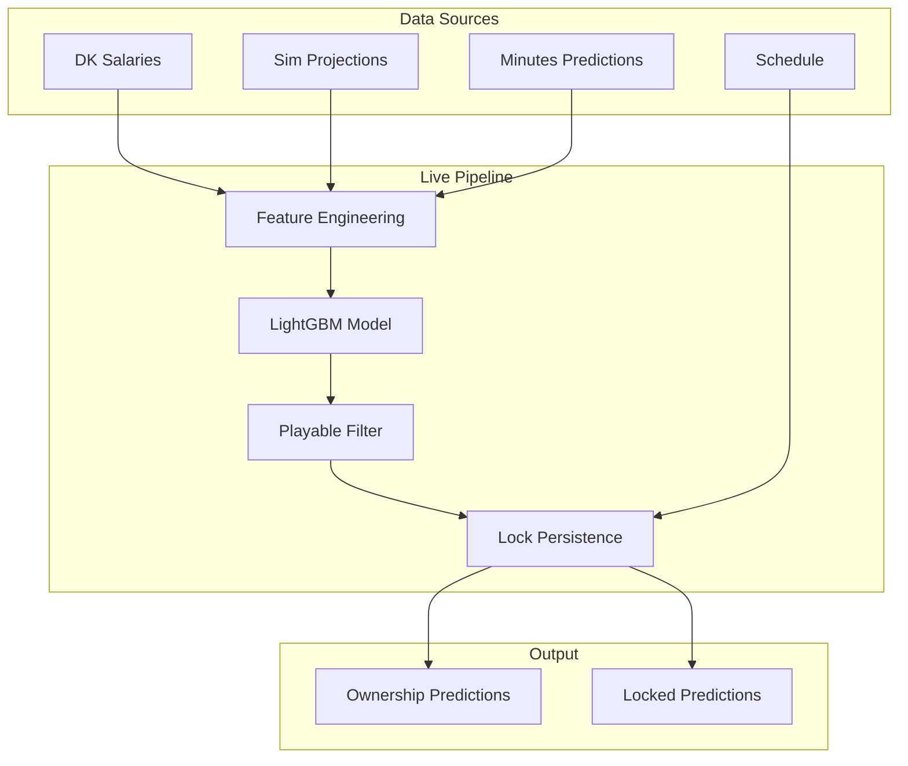

# Ownership Prediction System

This document describes the ownership prediction pipeline for DraftKings NBA slates.

## Overview

The ownership system predicts what percentage of lineups will contain each player. Accurate ownership predictions are critical for:
- **Tournament strategy**: Identifying chalk vs. contrarian plays
- **Lineup optimization**: Balancing ceiling with field exposure
- **Value estimation**: Players with low ownership + high ceiling offer leverage

## Architecture



## Components

### 1. Model (`ownership_v1`)

**Location**: `projections/ownership_v1/`

The core ownership model is a LightGBM regressor trained on historical ownership data.

#### Features
Key features used by the model:
- `value_per_k`: FPTS projection / (salary / 1000)
- `salary_rank`: Player's salary rank within slate
- `proj_fpts_rank`: FPTS rank within slate
- `proj_fpts_zscore`: Z-score of FPTS within slate
- `salary`: Raw salary
- `is_value_tier`, `is_mid_tier`, `is_high_tier`: Salary tier flags
- Position dummies: `pos_PG`, `pos_SG`, etc.

#### Training Data
- **Source**: Linestar projected ownership + DK contest actual ownership
- **Path**: `gold/ownership_training_base/ownership_training_base.parquet`

#### Production Model
- **Run ID**: `poc_013_chalk_5x`
- **Path**: `artifacts/ownership_v1/{run_id}/`

### 2. Live Scoring (`score_ownership_live.py`)

**Location**: `projections/cli/score_ownership_live.py`

Runs as part of the live pipeline to generate ownership predictions for upcoming slates.

```bash
python -m projections.cli.score_ownership_live \
    --date 2025-12-08 \
    --run-id live_v1
```

#### Data Flow
1. Load DK salaries (largest draft group = main slate)
2. Load FPTS projections from `sim_v2`
3. Match players via normalized names (handles European characters)
4. Filter OUT players (from injury status)
5. Compute ownership features
6. Run model prediction
7. Apply playable filter
8. Apply lock persistence
9. Save to `silver/ownership_predictions/{date}.parquet`

### 3. Playable Filter

Zeros out ownership for players who are truly unplayable (model assigns ownership based on salary, but player has no realistic chance of scoring).

**Config** (`config/ownership_calibration.yaml`):
```yaml
playable_filter:
  enabled: true
  min_proj_fpts: 8.0  # Players below this get 0% ownership
  slate_aware: false  # Optional: scale threshold with slate size
```

**Rationale**: The model was trained on Linestar data where even low-value players had ~10+ projected FPTS. Our sim correctly identifies unplayable players (< 1 FPTS), but the model never learned to handle them.

### 4. Lock Persistence

Preserves ownership predictions for games that have already started. Prevents ownership from shifting when feature calculations (ranks, z-scores) change as the slate shrinks.

**Config**:
```yaml
lock_persistence:
  enabled: true
```

**How it works**:
1. **First run** (before any games lock): Saves ALL predictions to `{date}_locked.parquet`
2. **Subsequent runs**:
   - Detects locked teams via schedule `tip_local_ts`
   - Loads locked predictions from file
   - Merges: locked teams from file + unlocked teams from current run

**Example with 7pm, 7:30pm, 10pm games**:
| Time | Action |
|------|--------|
| 6:30pm | Save all 100 players to locked file |
| 7:15pm | Merge: 20 (7pm teams from locked) + 80 (current run) |
| 7:45pm | Merge: 40 (7pm+7:30pm from locked) + 60 (current) |
| 10:15pm | Merge: 100 (all from locked) + 0 (current) |

### 5. Calibration (Disabled)

A softmax-style calibration layer that ensures predictions sum to R (8 for DK, where 8 roster slots × 100% = 800%).

**Status**: Currently disabled due to weak correlation between model predictions and actual ownership. Can be enabled once model improves.

**Config**:
```yaml
calibration:
  enabled: false
  R: 8.0
```

**Math**:
```
w_i = exp(a * s_i + b)
p_i = w_i / sum(w)
ŷ_i = R * p_i
```

## Configuration

**File**: `config/ownership_calibration.yaml`

```yaml
calibration:
  enabled: false
  calibrator_path: "artifacts/ownership_v1/calibrator.json"
  R: 8.0

playable_filter:
  enabled: true
  min_proj_fpts: 8.0
  slate_aware: false

lock_persistence:
  enabled: true

logging:
  log_metrics: true
```

## Output Files

| File | Description |
|------|-------------|
| `silver/ownership_predictions/{date}.parquet` | Final predictions (merged) |
| `silver/ownership_predictions/{date}_locked.parquet` | First-run predictions (immutable) |

### Output Columns
- `player_id`: NBA API player ID
- `player_name`: Display name
- `salary`: DK salary
- `pos`: Position(s)
- `team`: Team tricode
- `proj_fpts`: Sim FPTS projection
- `pred_own_pct`: Predicted ownership percentage
- `game_date`: Game date
- `run_id`: Pipeline run ID

## Known Limitations

1. **Model trained on Linestar data**: Weak correlation (0.111) between Linestar's projected ownership and actual ownership. Model improvements needed.

2. **Chalk underestimation**: Model tends to flatten ownership distribution. True 50%+ chalk plays may be predicted lower.

3. **First-run requirement**: Lock persistence requires the pipeline to run before the first game locks. If first run happens after games start, those predictions can't be recovered.

## Future Improvements

1. **Retrain with DK contest data**: Use `bronze/dk_contests/ownership_by_slate/` for cleaner labels
2. **Add FPTS as direct feature**: Help model distinguish playable vs unplayable value plays
3. **Re-enable calibration**: Once model correlation improves, calibration can enforce sum-to-800% constraint
4. **Position/salary marginals**: Add IPF layer for position and salary bin constraints
